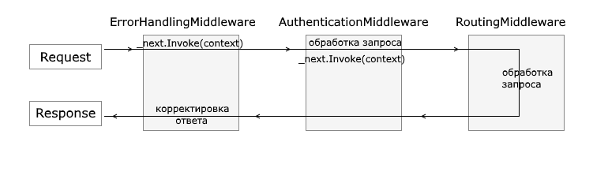

# ASP.NET Core (записки о изученном)

**ASP.NET Core** - платформа предназначенная для создания веб-приложений любого уровня сложности, является OpenSource проектом и полностью переосмыслена по сравнению с ASP.NET.

# Оглавление

* [Конвейер обработки запроса и middleware](#0)
    * [Жизненный цикл middleware](#0_0)
* [Методы Use, Run и делегат RequestDelegate](#1)
    * [Run](#1_0)
    * [Use](#1_1)
* [Методы Map и MapWhen](#2)
    * [Map](#2_0)
    * [MapWhen](#2_1)
* [Создание компонентов middleware](#3)
* [IHostingEnvironment и окружение](#4)
* [OWIN](#5)
* [Состояние приложения. Куки. Сессии](#6)
    * [HttpContext.Items](#6_0)
    * [Куки](#6_1)
    * [Сессии](#6_2)

## <a name="0"></a> Конвейер обработки запроса и middleware 

1. Термин **middleware** обозначает небольшие компоненты приложения, которые могут быть внедрены в конвейер обработки HTTP-запроса. Для подключения компонентов используется **метод Configure** класса **Startup**.
2. Компоненты **middleware** конфигурируются с помощью **методов расширений Run, Map, Use** объекта **IApplicationBuilder**, который передаётся в метод **Configure()**. 
    1. Каждый компонент может быть определён как анонимный метод (оно же встроенный inline компонент), либо может быть вынесен в отдельный класс. 
    2. Для создания компонентов используется делегат **RequestDelegate**, который выполняет некоторое действие и принимает контекст запроса ```public delegate Task RequestDelegate(HttpContext context);```.
3. **По умолчанию ASP.NET Core** предоставляет следующие встроенные компоненты middleware:
    1. **Authentification** - поддержка аутентификации
    2. **CORS** - поддержка кроссдоменных запросов
    3. **Response Caching** - позволяет кэшировать результаты запросов
    4. **Response Compression** - обеспечивает сжатие ответа клиенту
    5. **URL Rewriting Middleware** - предоставляет функциональность URL Rewriting
    6. **Routing** - определение используемых маршрутов
    7. **Session** - поддержка сессий
    8. **Static Files** - поддержка обработки статических файлов

### <a name="0_0"></a> Жизненный цикл middleware

1. Метод **Configure** и компоненты **middleware** выполняется один раз и живут в течение всего жизненного цикла приложения.
2. Для **последующей обработки** запросов используются **одни и те же компоненты**. То есть, предыдущий результат будет сохранён и использован при последующих запросах. Например, переменная инициализирована до запуска компоненты ```app.Run()``` с отправкой некой информации пользователю, а эта переменная неким образом изменяется в ходе выполнения компонента, в таком случае исходное значение переменной будет использовано только при первом обращении, в последующих будет происходить изменение в изменнёном ранее значении.

## <a name="1"></a> Методы Use, Run и делегат RequestDelegate

1. Данные методы используются **для конфигурации конвейера запроса**, метод **Configure()**класса **Statup**.

### <a name="1_0"></a> Run 

1. Представляет собой **простейший способ добавления** компонентов **middleware** в конвейер.
2. **Не передаёт** обработку запроса дальше.
3. Определяет **один единственный** делегат запроса.
4. **Суть делегата** заключается в отправке сообщения в ответ на запрос пользователя.
5. Следует помещать в конце.
6. В качестве параметра принимает **контекст запроса** (делегат ```RequestDelegate```, объект ```HttpContext```).

```C# 
app.Run(async (context) =>
{
    await context.Response.WriteAsync("Hello World!");
});
```

### <a name="1_1"></a> Use

1. В данном методе может быть **вызван следующий компонент middleware** в конвейере.
2. **В качестве параметров** принимает:
    1. Контекст запроса (делегат ```RequestDelegate```, объект ```HttpContext```)
    2. Делегат ```Func<Task>```
3. Для вызова следующего компонента используется делегат ```Func<Task>``` с использованием метода ```.Invoke()```
4. *Не рекомендуется:* помещать в ```.Use``` вызов метода передачи сообщения пользователю ```context.Response.WriteAsync("");```
   
```C#
int x = 5;
int y = 8;
int z = 0;
app.Use(async (context, next) =>
{
    z = x * y;
    await next.Invoke();
});

app.Run(async (context) =>
{
    await context.Response.WriteAsync($"x * y = {z}");
});
```

## <a name="2"></a> Методы Map и MapWhen

### <a name="2_0"></a> Map

1. Используется для сопоставления пути запроса с конкретным делегатом, который будет обрабатывать запрос.

```C#
public void Configure(IApplicationBuilder app)
{
    app.Map("/index", Index => //Маршрут /index обработка будет в методе Index
    {
        await index.Map("/title", Title); //Маршрут /index/title обработка будет в методе Title 
        await index.Map("/archive", Archive); //Маршрут /index/archive обработка будет в методе Archive 
    }); 
    app.Map("/about", About); //Маршрут /about обработка будет в методе About 
 
    app.Run(async (context) => //Если переданный путь не определён
    {
        await context.Response.WriteAsync("Page Not Found");
    });
}
 
private static void Index(IApplicationBuilder app)
{
    app.Run(async context =>
    {
        await context.Response.WriteAsync("Index");
    });
}
private static void Title(IApplicationBuilder app)
{
    app.Run(async context =>
    {
        await context.Response.WriteAsync("Title");
    });
}
private static void Archive(IApplicationBuilder app)
{
    app.Run(async context =>
    {
        await context.Response.WriteAsync("Archive");
    });
}
private static void About(IApplicationBuilder app)
{
    app.Run(async context =>
    {
        await context.Response.WriteAsync("About");
    });
}
```

### <a name="2_1"></a> MapWhen

1. Передаёт управление делегату, если передаваемая функция возвращает **true**. Является более "умной" реализацией ```.Map```.

```C#
app.MapWhen(context => { //если сработает условие, то передём управление делегату hendleId
        return context.Request.Query.ContainsKey("id") && context.Request.Query["id"] == "5";
    }, HandleId);
```

## <a name="3"></a> Создание компонентов middleware

1. Компонент **middleware** представляет из себя класс C#, содержащий обязательно метод ``` public async Task InvokeAsync(HttpContext context)()```.
2. Класс **middleware** должен иметь конструктор, который принимает параметр типа **RequestDelegate**.
3. В классе должен быть определён метод, который должен называться ```Invoke``` или ```InvokeAsync```.

```C#
public class TokenMiddleware
{
    private readonly RequestDelegate _next;
 
    public TokenMiddleware(RequestDelegate next)
    {
        this._next = next;
    }
 
    public async Task InvokeAsync(HttpContext context)
    {
        var token = context.Request.Query["token"];
        if (token!="12345678")
        {
            context.Response.StatusCode = 403;
            await context.Response.WriteAsync("Token is invalid");
        }
        else
        {
            await _next.Invoke(context);
        }
    }
}
```

4. Для использования самопального компонента используется ```.UseMiddleware<NameMiddleware>``` методе ```Confugure()```.
5. Для встраивания компонентов используются специальные методы расширения, для этого создаётся отдельный компонент со статическим методом типа **IApplicationBuilder** и названием расширения.

```C#
public static class TokenExtensions
{
    public static IApplicationBuilder UseToken(this IApplicationBuilder builder)
    {
        return builder.UseMiddleware<TokenMiddleware>();
    }
}
```

6. Выполнение компонента **middleware** делится на два этапа
    1. Код **ДО** ```await next.Invoke(context)```.
    2. Код **ПОСЛЕ** ```await next.Invoke(context)```.
7. Последовательность выполнения компонентов зависит от их физического расположения в коде (1->2->3->...->n).

```C#
public void Configure(IApplicationBuilder app)
{
    app.UseMiddleware<ErrorHandlingMiddleware>();
    app.UseMiddleware<AuthenticationMiddleware>();
    app.UseMiddleware<RoutingMiddleware>();
}
```



## <a name="4"></a> IHostingEnvironment и окружение

1. Данный интерфейс имеет ряд свойств:
    1. ```ApplicationName``` - возвращает имя приложения
    2. ```EnvironmentName``` - возвращает описание среды, в которой хостируется приложение
    3. ```ContentRootPath``` - возвращает путь к корневой директории приложения
    4. ```WebRootPath``` - возвращает путь к директории, в которой хранится статический контент (обычно директория **wwwroot**)
    5. ```ContentRootFileProvider``` - возвращает реализацию интерфейса **Microsoft.AspNetCore.FileProviders.IFileProvider**, которая может использоваться для чтения файлов из директории ContentRootPath
    6. ```WebRootFileProvider``` - возвращает реализацию интерфейса **Microsoft.AspNetCore.FileProviders.IFileProvider**, которая может использоваться для чтения файлов из директории WebRootPath
2. Приложение имеет **три описания среда**:
    1. Development
    2. Staging
    3. Production

## <a name="5"></a> OWIN

1. Спецификация **OWIN** (*Open Web Interface for .NET*) позволяет **отвязать веб-приложение** от конкретного веб-сервера и позволяет создать **самохостирующееся приложение**, определяет механизм использования компонентов **middleware** для обработки конкретных запросов и отправки ответа.

## <a name="6"></a> Состояние приложения. Куки. Сессии

### <a name="6_0"></a> HttpContext.Items

1. **После завершения** запроса все данные в ```HttpContext.Items``` **удаляются**.
2. **Подходит для данных**, которые связаны с запросом.
3. Можно использовать для передачи данных между компонентами middleware.

```C#
app.Use(async (context, next) =>
{
    context.Items["text"] = "Text from HttpContext.Items";
    await next.Invoke();
});

app.Run(async (context) =>
{
    context.Response.ContentType = "text/html; charset=utf-8";
    await context.Response.WriteAsync($"Текст: {context.Items["text"]}");
});
```

### <a name="6_1"></a> Куки

1. Максимальный объём, который можно передать равняется 4096 байт.
2. Для получения куки по ключу используется метод ```context.Request.Cookies["name"]```
3. Для добавления/удаления куки используется метод ```context.Response.Cookies.Append("nameCookie", "valueCookie")```.
   
### <a name="6_2"></a> Сессии

1. **Используется для сохранения** временных данных, которые доступны, пока пользователь работает с приложением.
2. По умолчанию, промежуток времени действия сессии равен 20 минутам.
3. Для взаимодействия с сессиями используются пакеты ```Microsoft.AspNetCore.Session``` и ```Microsoft.Extensions.Caching.Memory```.
4. Cессии работают поверх объекта ```IDistributedCache```.
5. Каждая сессия имеет свой идентификатор, который сохраняется в куки. По умолчанию эти куки имеют название **.AspNet.Session**.

```C#
public void ConfigureServices(IServiceCollection services)
{
    services.AddDistributedMemoryCache();
    services.AddSession();
}

public void Configure(IApplicationBuilder app)
{
    app.UseSession();
    app.Run(async (context) =>
    {
        if(context.Session.Keys.Contains("name"))
            await context.Response.WriteAsync($"Hello {context.Session.GetString("name")}!");
        else
        {
            context.Session.SetString("name", "Tom");
            await context.Response.WriteAsync("Hello World!");
        }
    });
}
```